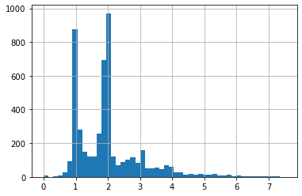

## Facilitating comparison of two data sets on broadband internet access

I participated in the September virtual Data Dive event with the organization [Data Kind](https://www.datakind.org/projects) which harnesses volunteer-based data science in service of social good. I chose to work on a project team trying to combine two commonly used datasets measuring broadband internet access across the U.S., in collaboration with the [University of Chicago CDAC](https://cdac.uchicago.edu/). In today’s world, affordable access to the internet is critical for educational and economic advancement. Analysis of these data can aid in identifying coverage gaps and inequity in access. The Ookla open dataset consists of actual Speedtest results run by users, reported at the level of square geographical tiles referenced by quadkey. The FCC internet access database reports advertised maximum broadband speed at the level of census tracts. Lastly, to help derive insight about availability, data were provided from the American Community Survey (ACS) which reports demographic information down to the level of census blocks. 

Both the Ookla and FCC data sets had their own set of biases and shortcomings. The FCC data were based on ISP self-report, states advertised theoretical maximum speed, and did not address whether households were able to afford that access. Nevertheless, it showed that less affluent areas were often offered worse internet speeds, likely reflecting less investment in infrastructure in those areas. The self-reported data also contained other curiosities. For instance, the number of providers offering download speeds of at least 100 Mbps (‘dn100’) was likely to be very close to a small integer, but not quite. The histogram made me want to know more about how the providers were determining, advertising, and reporting these numbers and how they were combined. 



The FCC data was subject to much criticism as it seemed too coarse and flawed to form the basis for allocating funds, such as through the Rural Digital Opportunity Fund (RDOF). Comparison with other data sets have shown significant incongruence between the FCC data and actual internet speeds, e.g.:
1.	[https://www.govtech.com/biz/microsoft-speeds-show-broadband-use-is-far-lower-than-access.html](https://www.govtech.com/biz/microsoft-speeds-show-broadband-use-is-far-lower-than-access.html)
2.	[https://www.govtech.com/network/paper-fcc-could-waste-up-to-1b-due-to-bad-map-data](https://www.govtech.com/network/paper-fcc-could-waste-up-to-1b-due-to-bad-map-data)
3.	[https://www.cnet.com/home/internet/the-fccs-broadband-map-wont-be-ready-for-a-year-this-data-company-has-already-built-one/](https://www.cnet.com/home/internet/the-fccs-broadband-map-wont-be-ready-for-a-year-this-data-company-has-already-built-one/)
4.	[https://dl.acm.org/doi/10.1145/3419394.3423652](https://dl.acm.org/doi/10.1145/3419394.3423652)

Therefore, comparison between the various data sets is important. Our first task was to simply aggregate the data so they can be compared. Fortunately, all three data sets contained a column for [FIPS GEOID](https://www.census.gov/programs-surveys/geography/guidance/geo-identifiers.html), an 11-digit (at the level of census tracts) unique geographical identifier including state, county, and census tract information. However, one of the challenges the University of Chicago CDAC partner was trying to deal with was that the Ookla data was released with _median_ speeds for each quadtile (which should be more robust to outliers with very high speeds). It was unclear how to properly aggregate medians without access to the underlying data. Fortunately, the CDAC partner discovered that the Ookla data were now being released as means rather than medians. However, to properly combine the means, it would be important to know whether they were taken across tests or across unique devices. The partner recalled that the Ookla site implied that it was averaged across tests, but at the same time felt that typically these should be averaged across devices such that users who run many tests (like internet researchers) would not come to dominate the data. It was suggested that we simply try doing an average weighted on the number of tests or the number of devices and compare. Ultimately, it did not seem to make a big difference.   

Next, the three data sets had to be merged or joined. We discussed whether we should perform an inner join or left join. Since we are interested in identifying data gaps (see also below), the inner join didn’t seem satisfactory. I preferred the idea of joining to the ACS data set which is presumably complete.

I suspected that Ookla data would have its own biases as one needs to have access to the internet and to know about Speedtest in order to run the test. Tech professionals may be more likely to run tests as well as to live in more affluent areas. Indeed, I found that the number of tests run normalized by population was highly significantly positively correlated with median household income (MHI) from the ACS (_p_ < 0.001). Therefore, measuring speeds may be hardest in areas where the data is most needed.

Possibly relatedly, others reported that many fewer census tracts were represented in the Ookla data than in the other data set. I noticed that census tracts could sometimes cross county lines, leading to one census tract corresponding to two distinct GEOIDs. However, it is likely there is genuinely significant shortage of coverage, and others planned to map these tracts to understand where the holes in the data might be.

Our one day event ended there, but I learned a ton.

Subsequently, I tested multiple ways to do the weighted average and their speeds. Although using .apply was most terse, simple math was the fastest. If calculating over all the states, these times may make a difference.

```
%%time

# Version 1: Apply
ookla_GEOID = (ookla_df1.groupby('GEOID')
              .apply(lambda x: pd.Series({'d_kbps': np.average(x.avg_d_kbps, weights=x.tests),'n_tests': x.tests.sum()}))
```
 Wall time: 3.31 s
```
%%time
# Version 2: Agg 
# Was a tad slower for weighted average alone, but faster when aggregating for multiple outputs

wa = lambda x: np.average(x, weights=ookla_df1.loc[x.index,'tests'])
ookla_GEOID = (ookla_df1
               .groupby('GEOID')
               .agg(d_kbps=('avg_d_kbps',wa),
                    n_tests=('tests','sum'))
)
```
 Wall time: 1.82 s
```
%%time

# Version 3: Manual weighted average
GEOIDs = ookla_df1.GEOID.unique()
ookla_GEOID = pd.DataFrame(np.nan, index=GEOIDs, columns=['d_kbps', 'n_quadkeys','n_tests'])
ookla_df1 = ookla_df1.assign(temp1 = lambda x: x.avg_d_kbps*x.tests)
ookla_GEOID = ookla_df1.groupby(['GEOID'])['tests'].sum().to_frame('n_tests')        
ookla_GEOID = pd.concat([ookla_GEOID, 
                        (ookla_df1.groupby(['GEOID'])['temp1'].sum()/ookla_GEOID.n_tests).to_frame('d_kbps')],axis=1)
```
 Wall time: 163 ms
